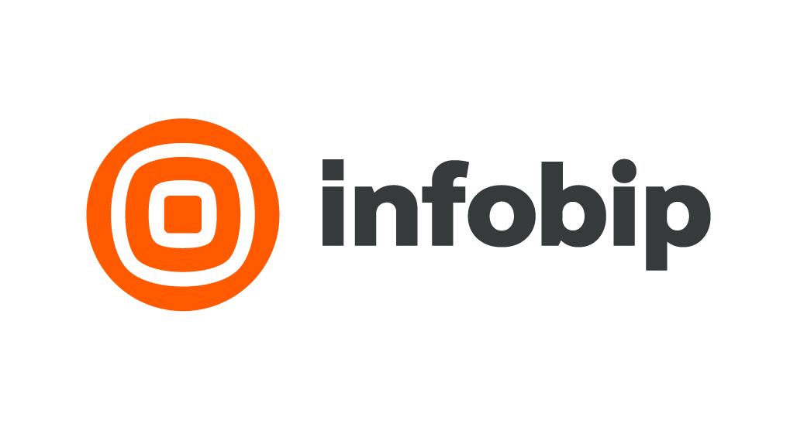
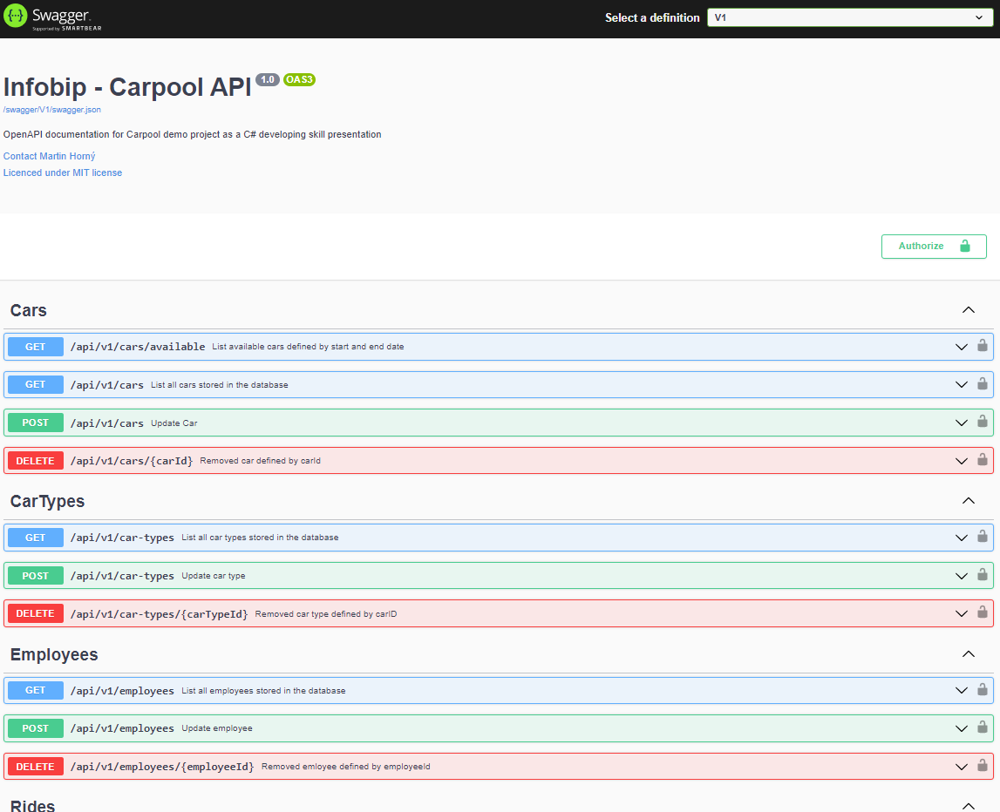

<a name="readme-top"></a>

<!-- PROJECT LOGO -->
<br />
<div align="center">
  <a href="">
    
  </a>

  <h3 align="center">Infobip Carpool API</h3>

  <p align="center">    
    <a href="swagger.json" target="_blank"><strong>Explore swagger.json »</strong></a>    
  </p>
</div>
<div align="center">

</div>
<!-- TABLE OF CONTENTS -->
<details>
  <summary>Table of Contents</summary>
  <ol>
    <li>
      <a href="#about-the-project">About The Project</a>
      <ul>
        <li><a href="#built-with">Built With</a></li>
      </ul>
    </li>
    <li>
      <a href="#getting-started">Getting Started</a>
      <ul>
        <li><a href="#prerequisites">Prerequisites</a></li>
        <li><a href="#installation">Installation</a></li>
      </ul>   
  </ol>
</details>


<!-- ABOUT THE PROJECT -->
## About The Project

[![Product Name Screen Shot][product-screenshot]](https://example.com)

Web application for visualizing carpool sharing, with the following
functionalities:

* Carpool data
* Employee data
* Ride sharing data management
* Carpool and ride sharing view per month

Here's why:
* API side is most important, so I focused on this part.
* Project requirement was prepare full application

Application is not fully working, but this is a great example how API should me propperly writen.

<p align="right">(<a href="#readme-top">back to top</a>)</p>


### Built With

* .NET 6.0 API with Controller 
* Swagger
* Microsoft SQL Server (Express)
* Entity Framework code first

<p align="right">(<a href="#readme-top">back to top</a>)</p>


<!-- GETTING STARTED -->
## Getting Started

For properly running applicaion is needed to instal Microsoft SQL Express or Microsoft SQL. Also Visual studio 2022 is recomended, or code is able to run in Studio Code


### Installation


1. Clone the repo
   ```sh
   git clone https://github.com/your_username_/Project-Name.git
   ```
2. Open project in Visual studio 2022
   
3. Modify `appsettings.json` an enter propper connection string in project `Carpool.CoreApi`
   ```json
   "ConnectionStrings": {
    "MicrosoftSQLConnection": "Server=.\\sqlexpress;Database=CarpoolDataBase;Trusted_Connection=True;TrustServerCertificate=True"}  
   ```
4. Open project in Visula studio 2022
5. Set `Carpool.CoreApi` as startup project
6. Debug -> Start Debuging 
7. Database with seed data will be installed
8. Swagger will bee show as default web page


<p align="right">(<a href="#readme-top">back to top</a>)</p>


 
